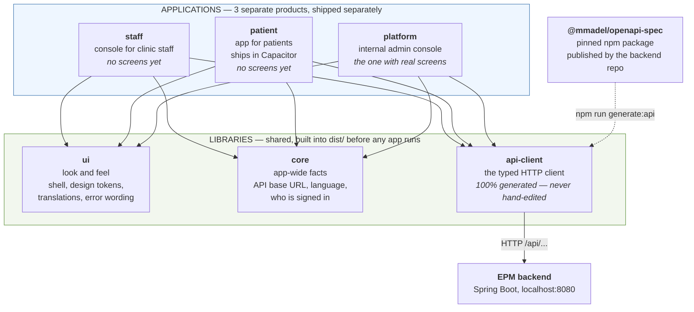
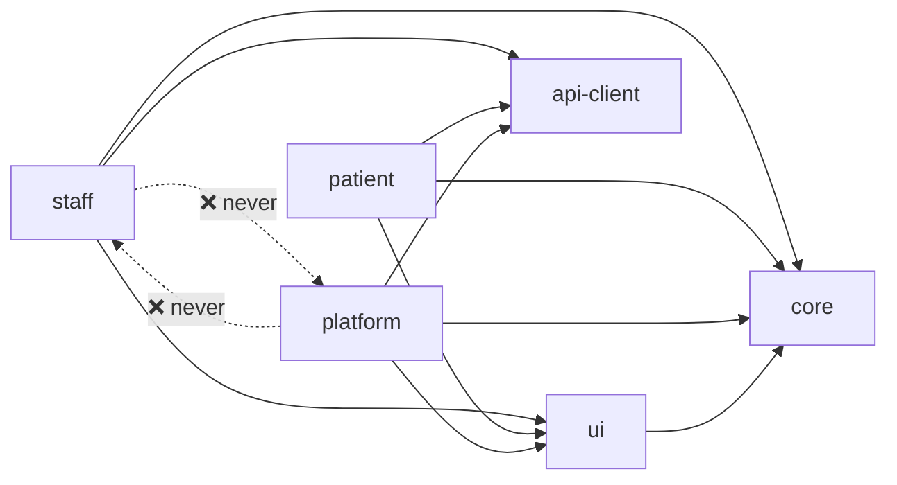
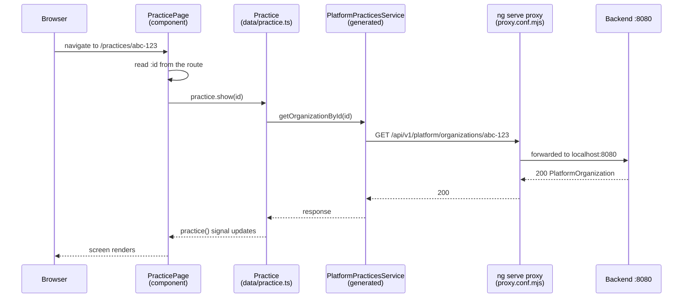
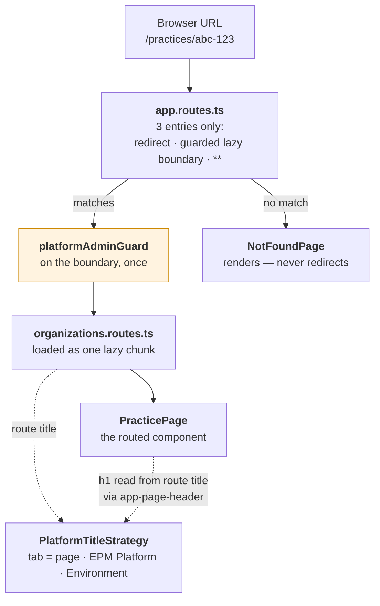
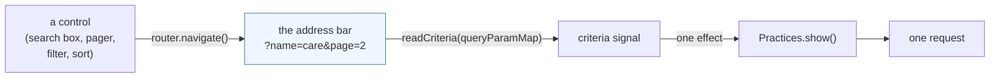
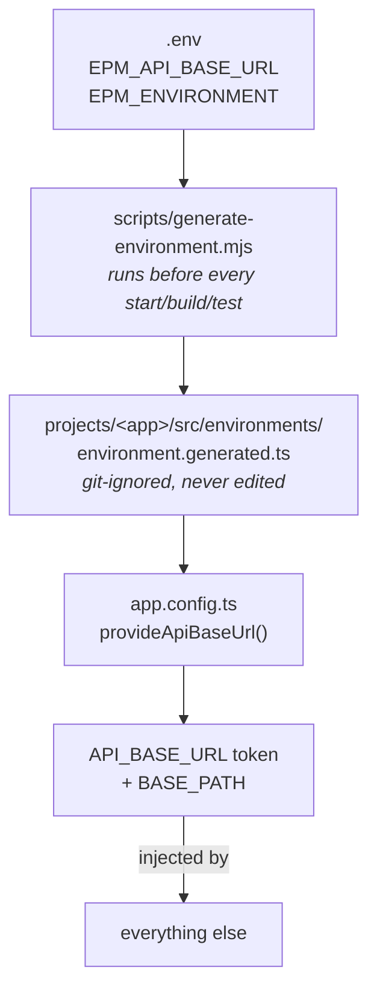
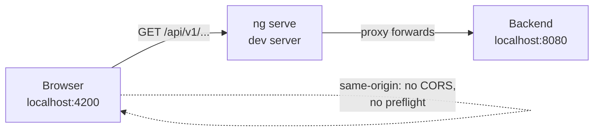

# Handover: how this workspace is put together

**Who this is for.** Somebody who has just been given this repository and has to
add a screen, change one, or fix something — and needs to know _where to start_.

It answers five questions:

1. What is each project for?
2. How do they talk to each other?
3. How does a URL become a screen? (routing, guards, titles, the URL as state)
4. Where do I put new code? (with a real example, step by step)
5. What is all the configuration at the root — the proxy, the `.env`, the tokens?

Everything here is a map. The detailed reasoning already lives next to the code:
[`README.md`](../README.md) for configuration, [`projects/platform/src/app/README.md`](../projects/platform/src/app/README.md)
for the application layout, [`docs/api-client.md`](api-client.md) for the API client,
[`docs/committing.md`](committing.md) for what to run before you push.

---

## 1. The whole picture

There are **six** projects under `projects/`. Three are applications (things a
person opens in a browser). Three are libraries (shared code the applications use).



The one-line version of each:

| Project      | Kind        | What it is for                                                                             |
| ------------ | ----------- | ------------------------------------------------------------------------------------------ |
| `api-client` | library     | Talking to the backend. Every request type and response type. **All generated.**           |
| `core`       | library     | Facts the whole app needs: the API URL, the current language, who is signed in. **No UI.** |
| `ui`         | library     | Things you can see and reuse: the page frame, colours/spacing, translations.               |
| `staff`      | application | The console clinic staff will use. Empty for now.                                          |
| `patient`    | application | The patient-facing app. Empty for now. Ships wrapped in Capacitor.                         |
| `platform`   | application | The internal console for people who run the platform. **Has the real screens.**            |

> **Note:** you listed five folders — `staff` also exists. It is a fourth sibling
> with an empty route table, waiting for its first feature ticket.

---

## 2. What each project is for, in plain words

### `api-client` — the phone line to the backend

Nothing in this repository writes a request or a response type by hand. The
backend publishes its own OpenAPI description as a **pinned npm package**
(`@mmadel/openapi-spec`), and `npm run generate:api` turns that into TypeScript
services under `projects/api-client/src/generated/`.

Today it gives you three services:

- `PlatformPracticesService` — list practices, read one, create one
- `PlatformOnboardingService` — onboarding
- `PlatformReferenceDataService` — plans

**Rules, and they are enforced by the build, not by goodwill:**

- Never edit anything under `generated/`. It gets wiped and rewritten.
- Never hand-write a type that mirrors a server type. The `epm/no-server-type-mirrors`
  ESLint rule fails the build — including for disguises like `FooDto`, `IFoo`, `FooPayload`.
- Never hard-code a `/api/...` URL. The `epm/no-relative-api-url` rule fails the build.
  (Reason: the patient app runs from a `capacitor://` origin, where `/api/x` points at
  the bundle and reaches no backend at all.)

**To pick up an API change:** bump the pinned version, regenerate, build. Anything
the backend renamed shows up as a compile error naming the field.

```bash
npm i -E @mmadel/openapi-spec@<new version>
npm run generate:api
npm run build
```

### `core` — facts, no pixels

Three things live here, and nothing here renders anything:

| Folder     | What it holds                                                                                                         |
| ---------- | --------------------------------------------------------------------------------------------------------------------- |
| `config/`  | `API_BASE_URL` token + `provideApiBaseUrl()`. Validates the URL at bootstrap and throws if it is wrong.               |
| `i18n/`    | `LanguageService` — the one place the active language lives. Sets `lang` and `dir` on the document, saves the choice. |
| `session/` | Who is signed in: `Session` types, `SESSION_SOURCE`, `isPlatformAdmin()`, and mock providers.                         |

The session type is worth one look, because it shows the house style. There are two
kinds of actor and they are _different types_, not one type with a nullable field:

```text
PlatformAdminSession        has NO organizationId — the property does not exist
OrganizationMemberSession   has organizationId
```

Reading `session.organizationId` on an admin is a **compile error**, not a runtime
surprise. That is the pattern to copy: make the wrong thing impossible to write,
rather than something a reviewer has to spot.

### `ui` — the shared look

| Folder    | What it holds                                                                                                                                                   |
| --------- | --------------------------------------------------------------------------------------------------------------------------------------------------------------- |
| `shell/`  | `Shell` — the page frame: edge strip, header, navigation column, content area.                                                                                  |
| `i18n/`   | The `translate` pipe, `TranslationService`, and the string files (`*.en.ts` / `*.ar.ts`).                                                                       |
| `errors/` | `ErrorMessage` — turning an RFC-9457 `Problem` response into a sentence a person reads. The server sends a stable `code`; the client owns every word on screen. |
| `styles/` | `_tokens.scss` — **the only file in the workspace allowed to hold a raw colour or a `px` spacing value.** Stylelint rejects them everywhere else.               |

`Shell` knows nothing about any one application. The header ends are projected
slots, navigation is an input, the content is `<ng-content>`. That is why the
platform console can mount the same shell and put its own environment chip in it.

Two conventions that will bite you if you miss them:

- **Use logical CSS properties** (`margin-inline-start`, never `margin-left`), so one
  stylesheet serves both Arabic and English. Stylelint enforces this.
- **The Arabic files currently contain English text on purpose.** Read
  [`projects/ui/src/lib/i18n/translations/README.md`](../projects/ui/src/lib/i18n/translations/README.md)
  before touching them. Do not add Arabic prose anywhere until a clinician signs it off.

### `platform` — the console with the screens

Three screens plus a "not found" page:

| URL                   | Screen            | What it does                                                                           |
| --------------------- | ----------------- | -------------------------------------------------------------------------------------- |
| `/practices`          | `PracticeList`    | Every practice, searchable. The landing screen; `/` redirects here.                    |
| `/practices/:id`      | `PracticePage`    | One practice: status, seat/branch meters, its branches.                                |
| `/practices/:id/edit` | `PracticeEdit`    | The edit form whose **submit is deliberately disabled** — no API route exists to save. |
| `/onboard`            | `OnboardPractice` | Creates a practice, its branches and its staff in one call.                            |

Two things about this console specifically: it is **English-only and LTR-only**
(nothing in it may touch `LanguageService` — a spec fails the build if it does),
and the **vocabulary on screen is the product's, not the schema's** — say _practice_,
not organization; _branch_, not clinic. The folder is called `organizations` because
that is the API's noun; the words a user reads are not.

---

## 3. How they talk to each other

### The arrows that are allowed



Three rules, all enforced by the custom ESLint rule `epm/no-cross-app-imports`:

1. **No application may import another application.** They ship separately. If two
   apps need the same thing, it moves into `ui` or `core`. If it does not belong
   there, it was not really shared.

   `platform → staff` is the one that is not about tidiness: platform administrators
   must never be able to open a patient's chart, and a single import would pull the
   staff surface into the platform bundle.

2. **No deep imports into a library.** Import from `'core'`, never from
   `'projects/core/src/lib/...'`. The short name is a path mapping in `tsconfig.json`
   pointing at `dist/`.

3. **Inside a feature, only `data/` may import `api-client`.** Components take inputs
   and emit outputs. A component that fetches is a component you cannot test without
   a network stub.

### How the short names resolve

`import { Shell } from 'ui'` does not read `projects/ui/`. It reads `dist/ui/`:

```jsonc
// tsconfig.json
"paths": {
  "api-client": ["./dist/api-client"],
  "core":       ["./dist/core"],
  "ui":         ["./dist/ui"]
}
```

**This is the single most common "why doesn't it compile" cause.** The libraries must
be built before an app can see them:

```bash
npm run build:libs      # ng build api-client && ng build core && ng build ui
```

Every `npm start:*` script does this for you first. But if you are _editing_ a
library while an app runs, the app will not pick the change up until the library is
rebuilt — so run this in a second terminal:

```bash
npx ng build core --watch
```

Stylesheets work the same way. `@use 'ui/styles'` in an app's `styles.scss` resolves
through `dist` too, because each app's build adds `dist` to the Sass load path
(`stylePreprocessorOptions.includePaths` in `angular.json`).

### One request, end to end

Here is what actually happens when someone opens `/practices/:id` in development:



Note the direction of every arrow: the component asks the **data service**, the data
service asks the **generated client**, and the generated client is the only thing
that knows a URL exists. The component never sees an HTTP call.

The base URL that the generated client uses comes from one place, wired once in
`app.config.ts`:

```ts
provideApiBaseUrl(API_BASE_URL_VALUE),                       // validated here
{ provide: BASE_PATH, useFactory: () => inject(API_BASE_URL) }, // derived, not re-supplied
```

The second line matters more than it looks: without `BASE_PATH`, the generated
`BaseService` silently falls back to `http://localhost` — so requests would not fail,
they would quietly go to whatever is on port 80.

---

## 4. Routing — how a URL becomes a screen

Routing here has a deliberate shape, and it is worth understanding before you add
a URL, because most of it is enforced by a spec that will fail your build.

### The chain, top to bottom



**`app.routes.ts` holds three entries and nothing else** — and it never names a
component from a feature:

| Entry        | What it is                                                                          |
| ------------ | ----------------------------------------------------------------------------------- |
| `''` (full)  | redirect to `/practices` — the console opens onto the list                          |
| `''` + guard | `loadChildren` → the feature's own route file. **The only reference to a feature.** |
| `'**'`       | `NotFoundPage`, guarded, with a title                                               |

### The five rules

1. **The guard sits on the boundary, not on each screen.** One `canActivate` on the
   lazy `''` route covers everything inside the feature, so a screen added later
   **cannot** arrive unguarded — even if the feature's route file forgets.
   It is `canActivate`, not `canActivateChild`, because the empty-path parent is
   activated itself.

2. **`app.routes.spec.ts` enforces it.** It walks whatever ends up in the route
   table and fails the build for a route with no guard — including nested paths,
   lazy boundaries, and a parent that guards only its children. Redirects are
   exempt (they activate nothing, and their destination is checked on its own).
   **You cannot ship an unguarded route in this console.**

3. **A 404 renders, it never redirects.** A silent redirect home turns a broken link
   into a working one — so the bookmark nobody can open, and the typo in a support
   thread, both look fine and get reported as "it works for me".

4. **One route file per feature, one lazy chunk.** Both practice screens live in one
   file because they are one feature reading the same noun from the same API — and
   a reader who lands on the list is very likely to open onboarding next.

5. **Every path string lives in `route-paths.ts`**, never hand-built at a call site.
   Constants for fixed paths, functions for parameterised ones:

   ```ts
   ROUTE_PATHS.practices; // '/practices'
   practicePath(id); // '/practices/<id>'
   editPath(id); // '/practices/<id>/edit'
   ```

   It sits beside `app.routes.ts` rather than inside the feature, because the things
   that link to a screen are not always inside it — the header wordmark and the
   not-found page both link home, and a feature importing the layout (or vice versa)
   would be a dependency in the wrong direction for the sake of a string.

### The route title does three jobs

Declaring `title: 'Practice'` on a route gives you all of these at once:

- **The browser tab**, composed by `PlatformTitleStrategy` as
  `Practice · EPM Platform · Local`. The environment is in the _title_, not just the
  header, because an admin with four tabs open is looking at the tab strip — and the
  tab is the last thing between them and creating a practice in the wrong place.
- **The `h1` on the screen**, because `<app-page-header>` reads the route title. That
  is why the tab and the heading cannot drift apart.
- **The focus target after navigation.** The frame moves focus to `main h1` after
  every completed navigation and announces it, since Angular's router does not move
  focus on its own.

`PracticePage` is the documented exception to the middle one: a route cannot know a
practice's name before the call that fetches it, so the title stays the constant
`Practice` for the tab and the screen renders its own `h1` — carrying
`tabindex="-1"`, because the frame will try to focus it.

### The URL _is_ the state

This is the pattern to follow for any screen with filters or paging, and
`PracticeList` is the reference implementation.



**Every control changes the URL and nothing else. One effect turns the URL into the
one call.** No control ever talks to the data service directly — that would be a
second source of truth, and the one the back button cannot reach.

What that buys you: a search is **shareable** into a support thread, and the **back
button undoes it**. Neither is true of a screen that keeps its filter in a field.

Four details worth copying when you build a screen like this:

- **Parse the whole address in one function.** `readCriteria(params)` returns one
  object from eight parameters. Eight separate signals would be eight places to
  forget one — and one place, rather than eight, where a hand-typed `?branches=-4`
  gets refused.
- **Write `null`, not `''`, for defaults.** `null` _removes_ a parameter, so the
  unrefined list is `/practices` and not `/practices?name=&status=&page=0`. The
  address someone shares should say what they were looking at and nothing else.
- **Reject nonsense from the address.** `Number('two')` is `NaN`, and `page=NaN`
  would go straight to the server. Both a missing and a hand-typed page land on 0.
- **Reset the page when the filter changes.** Page four of an unfiltered platform is
  not page four of the suspended ones — keeping the number asks for a page past the
  end and shows "found six, displaying none".

One exception worth knowing, because it looks like an omission: **the onboarding
steps are not routes.** Four addresses for one form would put four entries in the
browser's history, where Back would mean "undo one step of a form I have not
submitted" — which it does not.

### Routing in `staff` and `patient`

Both have `export const routes: Routes = []` — empty, waiting for their first
feature. When you add screens there, follow the same shape: lazy `loadChildren`
from `app.routes.ts`, one route file per feature, path strings in one place. Those
apps will need their own guard for a different kind of actor — `platformAdminGuard`
lives in `platform` precisely because it is not reusable.

---

## 5. Where do I start? A lookup table

| I want to…                                         | Go to                                                                         |
| -------------------------------------------------- | ----------------------------------------------------------------------------- |
| Add a screen to the platform console               | `projects/platform/src/app/features/<feature>/` — see §6                      |
| Change what a screen fetches                       | that feature's `data/` folder — nothing else calls the API                    |
| Add a URL                                          | the feature's `*.routes.ts`, **and** `route-paths.ts` — see §4                |
| Add a filter, sort or pager to a screen            | put it in the query string, not in a field — see "The URL _is_ the state", §4 |
| Change a colour, a spacing, a font                 | `projects/ui/styles/_tokens.scss` — the only place raw values are legal       |
| Change the page frame (header, nav, content area)  | `projects/ui/src/lib/shell/`                                                  |
| Add or change a translated string                  | `projects/ui/src/lib/i18n/translations/<area>.en.ts` (+ `.ar.ts`)             |
| Use a new backend endpoint                         | bump `@mmadel/openapi-spec`, `npm run generate:api` — never hand-write it     |
| Change the API URL / environment name              | `.env` at the root                                                            |
| Point at a backend on a different port             | `proxy.conf.json` — the only place `8080` appears                             |
| Add something every app needs (a token, a service) | `projects/core/src/lib/` + export it from `public-api.ts`                     |

---

## 6. Adding a new screen to `platform` — the worked example

This is exactly how `/practices/:id` was built (commits `5c320da`, `164c057`). Copy
the shape.

### The folder you are working in

```
projects/platform/src/app/
  app.ts                mounts the frame + the router outlet. Nothing else.
  app.config.ts         providers: session, environment, titles, HTTP, API URL
  app.routes.ts         ONLY lazy references to feature route files + the guard
  route-paths.ts        every URL in the console, in one place

  layout/               the console's chrome: shell instantiation, page header,
                        environment chip, route→tab-title strategy
  session/              the platform-admin guard
  environment/          which environment this bundle was built for

  features/
    organizations/           ← a feature. Deletable in one operation.
      organizations.routes.ts
      pages/                 ← routed components (one folder each)
      components/            ← used ONLY by this feature
      data/                  ← the ONLY place that imports api-client
```

**Feature folders, not type folders.** There is no top-level `services/`,
`components/` or `models/`. Those scale by _type_, so every change touches four
folders and after twelve features nobody can say which service belongs to which
screen.

### Step 1 — the data service (`data/practice.ts`)

One class. It owns the call and the states around it. It is `providedIn: 'root'`,
uses signals, and exposes _questions the screen asks_, not raw HTTP.

```ts
@Injectable({ providedIn: 'root' })
export class Practice {
  private readonly practices = inject(PlatformPracticesService);   // generated

  // `undefined` until a screen says which practice. An idle resource calls nothing.
  private readonly id = signal<string | undefined>(undefined);

  private readonly asked = rxResource({
    params: () => this.id(),
    stream: ({ params }) => this.practices.getOrganizationById(params),
  });

  readonly practice  = computed(() => (this.asked.hasValue() ? this.asked.value() : undefined));
  readonly isLoading = this.asked.isLoading;
  readonly failure   = computed<Failure | undefined>(() => /* 404 → 'missing', 400 → 'malformed', … */);

  show(id: string): void { this.id.update((c) => (c === id ? c : id)); }
  retry(): void { this.asked.reload(); }
}
```

Three details in there that are house rules, not taste:

- **Start idle.** Params of `undefined` means no call. Seeding with a default value
  means the screen fires one request for the default and a second for what the URL
  actually said — and renders the wrong one first.
- **`hasValue()` before `value()`.** A resource in an error state _throws_ from
  `value()`. Reading it unguarded puts that throw inside change detection and takes
  the whole screen down, including the retry button the user needs.
- **Name the failure kinds.** `missing` / `malformed` / `unreachable` are three
  different sentences the screen owes the reader, and only one of them is worth a
  retry button.

### Step 2 — the page component (`pages/practice/practice-page.ts`)

Reads the route, tells the data service what it wants, renders signals. No HTTP.

```ts
export class PracticePage {
  private readonly route = inject(ActivatedRoute);
  protected readonly practice = inject(Practice);

  private readonly params = toSignal(this.route.paramMap, { requireSync: true });
  protected readonly id = computed(() => this.params().get('id') ?? '');

  // one effect turns the address into the one call
  constructor() {
    effect(() => this.practice.show(this.id()));
  }
}
```

Alongside it: `practice-page.html`, `practice-page.scss` (tokens only), and
`practice-page.spec.ts`.

### Step 3 — the route

Add it to the **feature's** route file, never to `app.routes.ts`:

```ts
// features/organizations/organizations.routes.ts
{
  path: 'practices/:id',
  title: 'Practice',      // this is what the browser tab reads
  component: PracticePage,
}
```

`app.routes.ts` only ever holds `loadChildren`, and the guard sits on that boundary —
so a new screen inside the feature **cannot** arrive unguarded. `app.routes.spec.ts`
walks the route table and fails the build if a route appears without the guard.

### Step 4 — the path helper

Anything that links to the screen uses `route-paths.ts`, never a hand-built string:

```ts
export function practicePath(id: string): string {
  return `${ROUTE_PATHS.practices}/${id}`;
}
```

It lives beside `app.routes.ts` rather than inside the feature because the things
that link to a screen are not always inside it — the header wordmark and the
"not found" page both link home.

### Step 5 — the heading

Most screens use `<app-page-header>`, which takes its `h1` **from the route title**,
so the tab and the heading cannot disagree.

`PracticePage` is the one documented exception: a route cannot know a practice's
name before the call that fetches it. So the route title stays the constant
`Practice` for the tab, and the screen renders its own `h1` — carrying
`tabindex="-1"`, because the frame moves focus to `main h1` after every navigation.

**If you break a convention, write down why, next to the code that breaks it.** That
is the single strongest habit in this repository.

### Step 6 — the checklist before you push

```bash
git add -A
npm run lint
npm run format:check
npm test
npm run build
```

All five, in that order. The pre-commit hook runs only the first two — CI runs all
of them, so a commit the hook accepts can still turn a pull request red.
See [`docs/committing.md`](committing.md).

### Adding a whole new feature (not just a screen)

```
features/<feature>/
  <feature>.routes.ts
  pages/       one folder per routed screen
  components/  only used by this feature
  data/        the only place importing api-client
```

Then one lazy line in `app.routes.ts`. A feature **never** imports another feature —
if two need the same thing, it moves to `ui` or `core`.

### Adding to `ui` or `core` instead

Same steps for both:

1. Create the file under `src/lib/<area>/`.
2. **Export it from `public-api.ts`** — if you forget, apps cannot see it, and the
   error message will not tell you why.
3. `ng build ui` (or `core`) so `dist/` has it.
4. Component selectors use the `lib-` prefix in libraries and `app-` in applications.
   ESLint enforces this.

---

## 7. Configuration — every file at the root, and what it does



### The environment (`.env`)

Copy `.env.example` to `.env`. Two variables:

| Variable           | Legal values                                                    | Notes                                                                                                              |
| ------------------ | --------------------------------------------------------------- | ------------------------------------------------------------------------------------------------------------------ |
| `EPM_API_BASE_URL` | `/` (local, means same origin) **or** an absolute `http(s)` URL | Anything else — including empty — **fails the build before Angular starts**.                                       |
| `EPM_ENVIRONMENT`  | `local` / `development` / `staging` / `production`              | _Not_ validated. Anything unrecognised shows as `Unknown` in the platform header, with production's red treatment. |

Why empty is rejected but `/` is accepted: an unset variable, a blanked line and a
shell expansion that produced nothing all look identical. Nothing produces `/` except
somebody typing it.

**Applications never read the generated environment file.** Only `app.config.ts`
does, and it passes the value to `provideApiBaseUrl()`. Everything else injects the
`API_BASE_URL` token, which has no default — so a missing provider is a loud
injection failure, not a silent wrong URL.

### The development proxy — **two files, only one is configuration**

| File              | What it is                                                                                                        |
| ----------------- | ----------------------------------------------------------------------------------------------------------------- |
| `proxy.conf.json` | **The configuration.** The rule, the target, the port. The only place `8080` is written.                          |
| `proxy.conf.mjs`  | **The wrapper** that `angular.json` actually references. Re-exports the JSON rules and attaches an error handler. |

The rule is one line of intent: forward `/api` → `http://localhost:8080`.



**Why the wrapper exists.** This workspace serves with Vite, and Vite reports a
refused connection as a bare `ECONNREFUSED` that never says _where_ it was
connecting to. So the wrapper prints this instead:

```
[proxy] GET /api/v1/platform/plans -> http://localhost:8080 failed: ECONNREFUSED
[proxy] Nothing is listening on http://localhost:8080. The app is fine; the backend is not running.
```

That is the difference between "the backend is down" and "the app is broken". Read
it before debugging anything else.

**Same-origin is the point, not a convenience.** The onboarding request carries an
`Idempotency-Key` header. Cross-origin, that would need a preflight — and a failed
preflight looks exactly like the API being down.

**The proxy exists only under `ng serve`.** There is no proxy in a built bundle, which
is why `/` is a local-only value. `npm run lint` fails if any app's `serve` target
stops referencing the wrapper (`tools/dev-proxy/check-proxy.mjs`).

### The registry token

The OpenAPI spec is published to **GitHub Packages**, which authenticates every read.
So `npm ci` needs a classic personal access token with `read:packages`:

```bash
export NODE_AUTH_TOKEN=<token>          # bash
$env:NODE_AUTH_TOKEN = "<token>"        # PowerShell
```

`.npmrc` redirects only the `@mmadel` scope to GitHub Packages and reads that
variable. **No token is ever written to a file in this repository** — `npm run lint`
fails if one is. Without it, npm reports a package that exists as unreadable (401).
In CI the value is the `PACKAGES_READ_TOKEN` secret.

### `angular.json` — ports and builders

| App        | Dev server port           |
| ---------- | ------------------------- |
| `staff`    | 4200 (Angular default)    |
| `patient`  | 4200 (Angular default)    |
| `platform` | **4400** (set explicitly) |

⚠️ `staff` and `patient` both default to 4200, so you cannot serve both at once
without `--port`.

All three apps use `@angular/build:application`; all three libraries use
`ng-packagr`; tests everywhere use `@angular/build:unit-test` (**Vitest**, not Karma —
the library READMEs are stale CLI boilerplate and say Karma; ignore them).

### The custom lint rules (`tools/eslint-rules/`)

These are the workspace's architecture, made unbreakable. All are `error`.

| Rule                         | Stops you from…                                                           | Because…                                                                         |
| ---------------------------- | ------------------------------------------------------------------------- | -------------------------------------------------------------------------------- |
| `epm/no-cross-app-imports`   | importing one app from another, or reaching into `projects/<lib>/src/...` | apps ship separately; deep imports bypass the library's public API               |
| `epm/no-relative-api-url`    | writing `/api/patients` as a request URL                                  | the patient app runs on `capacitor://`, where that resolves to the bundle        |
| `epm/no-server-type-mirrors` | hand-writing a type that copies a generated one                           | a duplicate keeps compiling after the backend renames a field — a type that lies |

`npm run lint` runs **four** checks and always runs all of them (no short-circuit, so
one push tells you everything that is wrong): ESLint, Stylelint, the API-spec pin
check, and the dev-proxy wiring check.

### CI (`.github/workflows/ci.yml`)

Beyond lint/format/test/build, one job is worth knowing about: **"Generated API
client is current."** It regenerates the client and runs `git diff --exit-code`. If
the committed client does not match what the pinned spec produces, the build fails.
That is what stops a stale client — types that still compile and no longer describe
the API.

---

## 8. Commands you will actually use

```bash
# first time
cp .env.example .env
export NODE_AUTH_TOKEN=<token>
npm ci

# run something (each rebuilds libs + regenerates the env file first)
npm start                # staff  → :4200
npm run start:patient    # patient → :4200
npm run start:platform   # platform → :4400

# with a local backend, in the backend repo:
.\mvnw.cmd spring-boot:run

# while editing a library, in a second terminal
npx ng build core --watch

# API changed
npm i -E @mmadel/openapi-spec@<version> && npm run generate:api && npm run build

# before pushing — all five
git add -A && npm run lint && npm run format:check && npm test && npm run build
```

---

## 9. Traps worth knowing before you hit them

1. **`Cannot find module 'core'`** → you did not run `npm run build:libs`. Apps read
   libraries from `dist/`, not from source.
2. **Editing a library while an app runs changes nothing** → same reason. Run
   `npx ng build <lib> --watch` in a second terminal.
3. **The dev server answers HTTP 200 even when the bundle failed to compile.** A page
   loading is not evidence it built. Look for `Application bundle generation complete`
   in the terminal.
4. **`ECONNREFUSED` in the terminal** → the backend is not running. The proxy names
   the target on purpose. Do not debug the app.
5. **Do not edit anything under `api-client/src/generated/`.** It is wiped on every
   regeneration and CI compares it byte-for-byte.
6. **Do not add a `lang`/`dir`-aware anything to `platform`.** It is English-only by
   decision, and a spec fails the build if the language service is constructed.
7. **Never use `margin-left` / raw colours / raw `px` spacing** outside
   `ui/styles/_tokens.scss`. Stylelint will tell you which token to use instead.
8. **A component must not fetch.** Put the call in the feature's `data/` folder.

---

## 10. Where to read more

| Topic                                               | File                                                                                                    |
| --------------------------------------------------- | ------------------------------------------------------------------------------------------------------- |
| Environment, proxy, tokens, i18n, shell             | [`README.md`](../README.md)                                                                             |
| Application layout + the platform screens in detail | [`projects/platform/src/app/README.md`](../projects/platform/src/app/README.md)                         |
| Bumping the API version, reading the diff           | [`docs/api-client.md`](api-client.md)                                                                   |
| What runs where before you push                     | [`docs/committing.md`](committing.md)                                                                   |
| Colours, spacing, type, Arabic fonts                | [`docs/design-tokens.md`](design-tokens.md)                                                             |
| The onboarding screen's design decisions            | [`docs/PLATFORM/onboarding-screen.md`](PLATFORM/onboarding-screen.md)                                   |
| Translation folder + key conventions                | [`projects/ui/src/lib/i18n/translations/README.md`](../projects/ui/src/lib/i18n/translations/README.md) |

**One last thing.** Almost every file in this repository carries a class-level or
file-level comment explaining _why_ it is the way it is — including the things that
were tried and removed. Before changing something that looks odd, read the comment
above it. It usually already answers the question you are about to ask.
